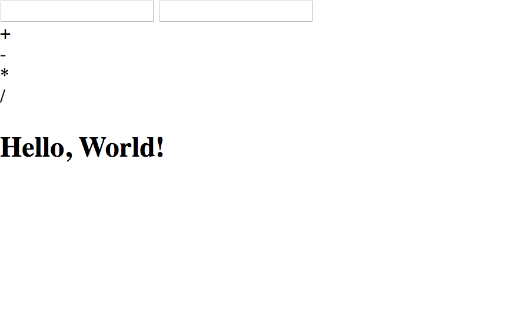

# OOP Calculator
A calculator done using object-oriented programming.

**Link to project:**
https://quirky-aryabhata-167d92.netlify.com/

## How It's Made:

**Tech used:** little bit of HTML, CSS & a lot of Javascript

So I took a previous version of a JS calculator and I converted it into an object-oriented program.

## Lessons Learned:

This was the first project i did with OOP so this helped me with learning the structure and overall syntax of OOP.  

## Examples:
Take a look at these couple examples that I have in my own portfolio:

**Palettable:** https://github.com/alecortega/palettable

**Twitter Battle:** https://github.com/alecortega/twitter-battle

**Patch Panel:** https://github.com/alecortega/patch-panel
