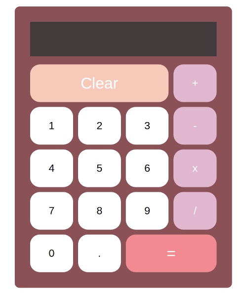

# OOP Calculator
Build a Simple Calculator using JS OOP best practices

**Link to project:** https://dreamy-newton-b08b4b.netlify.com

## How It's Made:

**Tech used:** HTML5, CSS3, JavaScript
Styling for this project was done using a CSS Grid layout. Calculator behavior was written implementing object oriented programming in Javascript.

## Optimizations
Found it more efficient to iterate through a class of buttons vs having to write a different click event for each button.

## Lessons Learned:
This was my first attempt at writing a project with object oriented programming. Enjoyed that OOP kept my Javascript really organized.

## Examples:

**To-do List:** https://github.com/Eriquette/todo-list-2018c-week05/tree/answer

**Daily Code Challenges:** https://github.com/Eriquette/Daily-Code-Challenges

**Picture Gallery:** https://github.com/Eriquette/carousel-bootcamp2018c-week05
