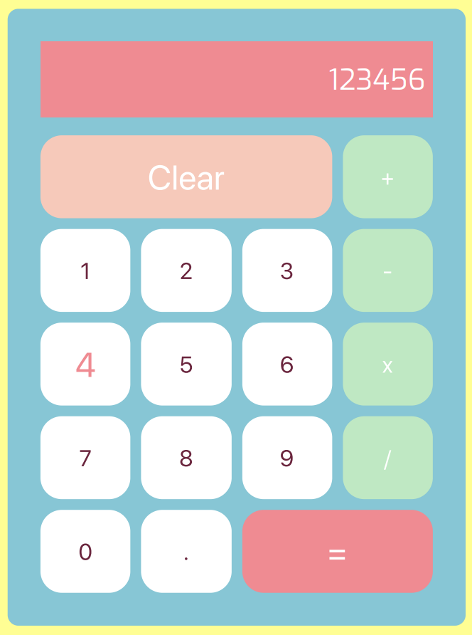

# 🔢 Quick Maths!
This project is a simple calculator for users to perform quick maths!

**Link to project:** https://pedantic-golick-4c339d.netlify.com/

## How It's Made:

**Tech used:** HTML, CSS, JavaScript

Using JavaScript I built a basic calculator. The user has the ability to set perform simple arithmetic calculations through the inputs. When the user enters a number and operator, the calculator stores these values then allows for a second input as well. After clicking on "=" the answer is displayed in the input field. Using object-oriented programming, I designed a calculator object with 3 properties and simple methods to do various calculations.

## Lessons Learned:

Object oriented programming, and CSS Grid.

## Related Projects:
Take a look at these cool projects that I have in my portfolio:

**Slot Machine:** https://tender-brahmagupta-7fb0c7.netlify.com

**Attendance List:** https://sleepy-franklin-b8d685.netlify.com/

**To-Do List:** https://tender-ritchie-caee3b.netlify.com/
